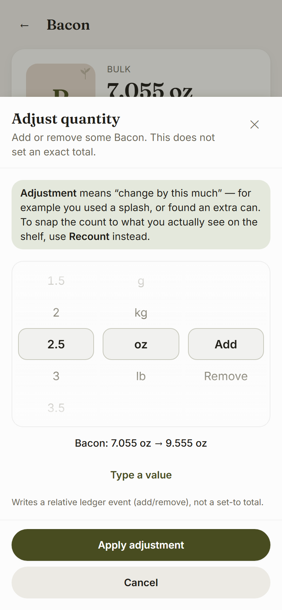
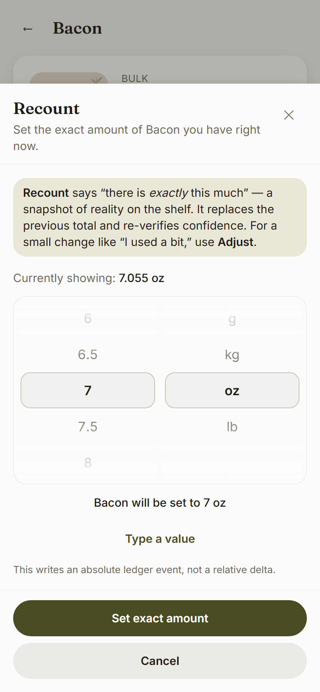

# Feature: iOS-style picker wheels for Adjust / Recount

**Date:** 2026-07-27  
**Scope:** `apps/web/src/ui/**`, `apps/web/src/features/pantry/**`, `apps/web/scripts/verify-chrome.mjs`  
**Core:** read-only (279 tests green)

---

## Outcome

Adjust, Recount, Waste, and Add-item no longer open a keyboard by default. They use scroll-snap wheel pickers that are thumb-operable one-handed. The ledger distinction is preserved:

| Action | Wheels | Ledger write |
|--------|--------|--------------|
| **Adjust** | qty · unit · **add/remove** (3) | `relative` / `adjust_delta` |
| **Recount** | qty · unit (2) | `absolute` / `recount` |
| **Waste** | qty · unit (2), direction fixed remove | `relative` / `waste` (negative) |
| **Add item** | qty · unit (2) | `relative` / `purchase` (positive) |

---

## Component API

### `WheelColumn` — `apps/web/src/ui/WheelColumn.tsx`

Single scroll-snap listbox column.

```ts
type WheelOption = { value: string; label: string };

type WheelColumnProps = {
  options: readonly WheelOption[];
  value: string;
  onChange: (value: string) => void;
  'aria-label': string;
  'data-testid'?: string;
  rowHeight?: number;   // default 44
  visibleRows?: number; // default 5
};
```

- CSS `scroll-snap-type: y mandatory`, centred selection band, fade masks
- `role="listbox"` + `role="option"` + `aria-activedescendant`
- Arrow / Home / End / Page keys
- 44px row height (tap targets)
- Haptic tick on detent via `selectionTick()` (`@capacitor/haptics`; silent no-op on web)

### `QuantityPickerWheels` — `apps/web/src/features/pantry/components/QuantityPickerWheels.tsx`

Composed multi-wheel control for pantry sheets.

```ts
type QuantityPickerWheelsProps = {
  mode: 'adjust' | 'recount' | 'waste' | 'add';
  dim: Dimension;
  itemName: string;
  currentQtyBase?: number;
  preferredUnit?: string;
  onOutcomeChange?: (outcome: PickerOutcome | null) => void;
  resetKey?: string | number | boolean; // re-seed when sheet opens
};
```

DOM markers for chrome harness:

- `data-testid="quantity-picker-wheels"`
- `data-wheel-count="2" | "3"`
- `data-picker-wheel="true"` per column
- `data-testid="picker-wheel-quantity" | unit | direction`
- `data-testid="picker-preview"`, `picker-type-toggle`

### Pure logic — `apps/web/src/features/pantry/lib/picker-wheels.ts`

| Export | Role |
|--------|------|
| `unitsForDimension(dim)` | Unit options for the wheel (dimension-gated) |
| `quantityStepsForUnit(unit)` | Adaptive step table |
| `rescaleQuantityForUnitChange(qty, from, to)` | Keep equivalent amount via `convert()` |
| `seedPickerSelection(mode, dim, currentQtyBase?)` | Adjust→0; Recount→current |
| `resolvePickerOutcome(sel, mode, current?)` | Signed/absolute base qty |
| `formatPickerPreview(...)` | Live preview string |
| `wheelCountForMode(mode)` | 3 for adjust, 2 otherwise |

---

## Step tables per unit

| Unit | Steps |
|------|--------|
| **g / ml** | 0→100 by **1**, then by **5** to 500, then by **25** to 5000 |
| **kg / l** | 0→2 by **0.05**, then by **0.25** to 25 |
| **oz / fl oz** | 0→200 by **0.5** |
| **lb** | 0→50 by **0.25** |
| **each** | 0→500 by **1** |
| **dozen** | 0→40 by **1** |
| **cup / tbsp / tsp** | Cooking fractions: 0, ¼, ⅓, ½, ⅔, ¾, 1, 1¼, … |

Labels for cooking units use glyphs (`¼`, `⅓`, `½`, …).

---

## Unit change preserves amount

When the unit wheel moves:

1. `convert({ value: qty, fromUnit, toUnit })` via `@larder/core`
2. Snap to `nearestStep` in the **new** unit’s table
3. Quantity wheel options recompute for the new unit

Example: 2 lb → ≈907 g → snaps to 900 g (25 g band, &lt;3% error). Does **not** reset to zero.

Default unit is the one `formatQuantity` would show for the current stock (so the wheel starts where the row already reads).

---

## Adjust vs Recount stay distinct

**UI**

- Adjust: third wheel **Add / Remove**; copy says “change by this much”; preview `Flour: 4 lb → 2 lb`
- Recount: **no** direction wheel; copy says “there is *exactly* this much”; preview `Flour will be set to 2 lb`
- `data-wheel-count` is 3 vs 2 (asserted in `verify-chrome.mjs`)

**Ledger** (unchanged builders)

```ts
buildAdjustTxn(item, deltaBase)  // kind: 'relative', reason: 'adjust_delta'
buildRecountTxn(item, targetBase) // kind: 'absolute', reason: 'recount'
```

Tests in `picker-wheels.test.ts` build both txns from picker outcomes and assert the kinds.

---

## Haptics and accessibility

**Haptics** — `apps/web/src/ui/haptics.ts`

- Dynamic import of `@capacitor/haptics` → `ImpactStyle.Light`
- Skipped when plugin missing (web) or `prefers-reduced-motion: reduce`
- Never throws

**Accessibility / keyboard path**

- Each wheel is a real `listbox` with arrow-key navigation
- **“Type a value”** demotes (does not delete) the numeric input path
- Typed text uses existing `parseHumanQuantity` / `parseHumanDelta` (dimension-checked)
- Live preview under wheels with `aria-live="polite"`
- Global CSS already forces `scroll-behavior: auto` under reduced motion

---

## Sheet footer fix

Tall wheel content pushed confirm off-screen on iPhone viewports. `ui/Sheet.tsx` now uses a flex column with **scrollable body** and **pinned footer** so Apply / Set exact amount always remain free targets (no new z-index layers).

---

## Screenshots (390×844)

### Adjust — three wheels



### Recount — two wheels



---

## Verification

```
npm run typecheck && npm run lint && npm run test && npm run build
node scripts/verify-chrome.mjs && node scripts/verify-interactivity.mjs
```

| Suite | Result |
|-------|--------|
| `packages/core` | **279** passed |
| `apps/web` | **273** passed (252 prior + **21** picker tests) |
| typecheck / lint / build | green |
| `verify-chrome.mjs` | all passed — Adjust 3 wheels, Recount 2, confirm free |
| `verify-interactivity.mjs` | all passed |

New tests cover: unit options match dimension, unit change preserves amount, step sizes, adjust relative vs recount absolute, preview matches resulting quantity.

No commits created (per brief).
