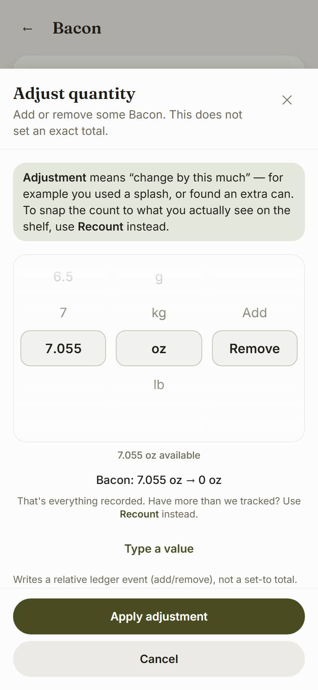

# Feature: Clamp the Remove wheel to on-hand stock

**Date:** 2026-07-27  
**Scope:** `apps/web/src/ui/**`, `apps/web/src/features/pantry/**`, `apps/web/scripts/verify-chrome.mjs`  
**Core / recipes / cook:** untouched (279 core tests green; cook still prompts on shortfall)

---

## Outcome

When Adjust is on **Remove** (and always for **Waste** / mark-used paths that are pure removals), the quantity wheel cannot dial past what is recorded on hand. Selecting the cap lands the item at **exactly zero**, never negative. Someone who truly used more than the ledger knows is steered to **Recount**.

Cooking remains a different story: shortfall is discovered, not dialled — `NegativeStockPrompt` still fires.

---

## How the cap is computed

Pure helpers live in `apps/web/src/features/pantry/lib/picker-wheels.ts`.

| Helper | Role |
|--------|------|
| `isRemovalSelection(mode, direction)` | True for Adjust+Remove and Waste |
| `onHandInUnit(currentQtyBase, dim, unit)` | `convertBaseToUnit` via `@larder/core` |
| `quantityStepsForRemoval(unit, maxQty)` | Full step table clipped to max; **exact on-hand appended** so the last detent is everything |
| `clampSelectionForRemoval(sel, mode, base, dim)` | Pulls qty down when over cap; snaps onto a step in the table |
| `formatAvailableAmount(...)` | `"1.824 lb available"` |
| `isAtRemoveCap(...)` | True when selection is at the on-hand maximum |
| `canRemoveStock(base)` | `base > 0` |

### Cap formula

```
maxDisplay = convertBaseToUnit(currentQtyBase, dim, selectedUnit).value
steps     = quantityStepsForUnit(unit).filter(s => s ≤ maxDisplay)
            ∪ { maxDisplay }   // exact amount so max → zero
```

### Re-derive on unit change

1. Unit wheel moves → `rescaleQuantityForUnitChange` (core `convert()`) keeps equivalent amount.  
2. Immediately `clampSelectionForRemoval` re-applies against the **new** unit’s on-hand max.  
3. Quantity options recompute via `quantityStepsForRemoval`.

Example: 1.824 lb on hand → lb wheel max ≈ 1.824. Switch to oz → max ≈ 29.2 oz (exact converted value). Unclamped oz table goes to 200; capped table stops at on-hand.

### Direction switches

- **Add → Remove** with an out-of-range qty (e.g. 5 lb while 1.824 on hand) → selection pulled down to the cap.  
- **Remove → Add** → full step table restored; cap lifts.  
- **Zero stock** → Remove is not offered on the direction wheel; Waste shows an empty state (“Nothing on hand to remove”) with a Recount link.

### Ledger write safety

`resolvePickerOutcome` for adjust-remove / waste, when `currentQtyBase` is known and the dialled amount ≥ on-hand, sets:

- adjust: `qtyBase = -currentQtyBase`, `resultQtyBase = 0`  
- waste: `qtyBase = currentQtyBase`, `resultQtyBase = 0`

So even a typed oversize value cannot write a negative balance from these sheets.

---

## What the user sees at the cap

1. **Available label** under the wheels: e.g. `7.055 oz available` (`data-testid="picker-available"`).  
2. **Live preview** goes to zero: `Bacon: 7.055 oz → 0 oz`.  
3. **Quiet Recount hint** (`data-testid="picker-cap-hint"`):

   > That's everything recorded. Have more than we tracked? Use **Recount** instead.

   The word Recount is a button (`data-testid="picker-recount-link"`) that opens the Recount sheet from Adjust / Waste (`onRequestRecount` → `setSheet('recount')` on `PantryItemScreen`).

DOM markers:

- `data-removal-clamped="true"` when the qty wheel is capped  
- `data-testid="picker-remove-empty"` when stock is already zero and removal is blocked  

---

## Screenshot — Remove at maximum



Also: `reports/screens/picker-remove-clamp-390.png`  
Capture: `node apps/web/scripts/screenshot-remove-clamp.mjs`

Bacon fixture, Adjust → Remove, quantity scrolled to cap: available line, preview → 0, Recount hint.

---

## Cook flow boundary (untouched)

**No edits** under `apps/web/src/features/recipes/**` or cook routes.

SPEC remains: cooking more than recorded **prompts** “still have some?” rather than clamping. A dedicated test in `picker-wheels.test.ts` imports `cook-machine` and asserts:

```
used 200 g > have 100 g  →  phase === 'negative_prompt'
```

Chrome harness still opens cook → Substitute without change. Interactivity cook E2E still logs and undoes.

---

## Files touched

| Path | Change |
|------|--------|
| `features/pantry/lib/picker-wheels.ts` | Cap helpers + resolve clamp for remove/waste |
| `features/pantry/lib/picker-wheels.test.ts` | Clamp suite + cook boundary |
| `features/pantry/components/QuantityPickerWheels.tsx` | Clamped options, available label, cap hint, empty remove |
| `features/pantry/components/AdjustSheet.tsx` | `onRequestRecount` |
| `features/pantry/PantryItemScreen.tsx` | Wire recount from Adjust/Waste |
| `scripts/verify-chrome.mjs` | Waste: `data-removal-clamped` + available/empty chrome |
| `scripts/screenshot-remove-clamp.mjs` | Report screenshot (new, untracked helper) |

**Not touched:** `packages/core/**`, `supabase/**`, `native/**`, `features/recipes/**`, cook pages, `NegativeStockPrompt`.

---

## Verification

```
npm run typecheck   ✅
npm run lint        ✅
npm run test        ✅  283 web (was 273; +10 clamp/boundary)
npm run build       ✅
node scripts/verify-chrome.mjs           ✅  (incl. Waste clamp chrome)
node scripts/verify-interactivity.mjs    ✅
npm run test -w @larder/core             ✅  279 core
```

### Tests added (picker-wheels)

- Remove wheel max equals on-hand in selected unit  
- Changing unit re-clamps (lb → oz)  
- Add → Remove pulls out-of-range selection down  
- Removing the maximum → exactly zero, never negative  
- Waste also capped  
- Available label format  
- `isAtRemoveCap` / `isRemovalSelection`  
- Add path not clamped  
- **Cook exceeding stock still reaches `negative_prompt`**

No commits created (per brief).
